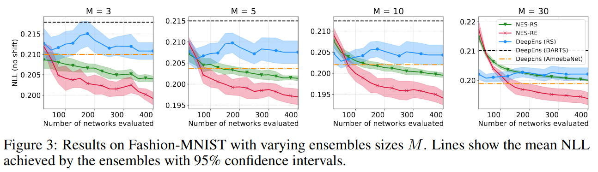

# Neural Ensemble Search

## Introduction
This repo contains the code accompanying the paper:

[Neural Ensemble Search for Performant and Calibrated Predictions](https://arxiv.org/abs/2006.08573)

Authors: Sheheryar Zaidi*, Arber Zela*, Thomas Elsken, Chris Holmes, Frank Hutter and Yee Whye Teh.

The paper introduces two NES algorithms for finding ensembles with varying baselearner architectures with the aim of producing performant and calibrated predictions for both in-distribution data and during distributional shift.

The code, as provided here, makes use of the [SLURM](https://slurm.schedmd.com/overview.html) job scheduler, however, one should be able to make changes to run the code without SLURM.

News: Oral presentation at the [Uncertainty & Robustness in Deep Learning (UDL) Workshop @ ICML 2020](https://sites.google.com/view/udlworkshop2020/home?authuser=0)

## Setting up virtual environment

First, clone and cd to the root of repo:

```
git clone https://github.com/automl/nes.git
cd nes
```

We used Python 3.6 and PyTorch 1.3.1 with CUDA 10.0 (see `requirements.txt`) for running our experiments. For reproducibility, we recommend using these python and CUDA versions. To set up the virtual environment execute the following (`python` points to Python 3.6):

`python -m venv venv`

Then, activate the environment using:

`source venv/bin/activate`

Now install `requirements.txt` packages by:

`pip install -r requirements.txt -f https://download.pytorch.org/whl/torch_stable.html`

## Generating the CIFAR-10-C dataset
To run the experiments on CIFAR-10-C [(Hendrycks and Dietterich, ICLR 2019)](https://arxiv.org/pdf/1903.12261.pdf), first generate the shifted data. Begin by downloading the CIFAR-10 dataset by executing the following command:

`python -c "import torchvision.datasets as dset; dset.CIFAR10(\"data\", train=True, download=True)"`

Next, run the `cluster_scripts/generate_corrupted.sh` script to generate the shifted data using the command:

`sbatch -p $GPU_CLUSTER_PARTITION cluster_scripts/generate_corrupted.sh`

`$GPU_CLUSTER_PARTITION` is the name of the cluster partition you want to submit the array job to. 

To run this without SLURM, use the following command which runs sequentially rather than in parallel:

`for i in 0..18; do PYTHONPATH=$PWD python data/generate_corrupted.py $i; done`

## Running the experiments

The structure for running the two Neural Ensemble Search (NES) algorithms, NES-RS and NES-RE consists of three steps: train the base learners, apply ensemble selection and evaluate the final ensembles. We compared to three deep ensemble baselines: DeepEns (RS), DeepEns (DARTS) and DeepEns(AmoebaNet). The latter two simply require training the baselearners and evaluating the ensemble. For DeepEns (RS), we require an extra intermediate step of picking the "incumbent" architecture (i.e. best architecture by validation loss) from a randomly sampled pool of architectures. For a fair and efficient comparison, we use the same randomly sampled (and trained) pool of architectures used by NES-RS.

### Running NES

We describe how to run NES algorithms for CIFAR-10-C using the scripts in `cluster_scripts/cifar10/`; for Fashion-MNIST, proceed similarly but using the scripts in `cluster_scripts/fmnist/`. For NES algorithms, we first train the base learners in parallel by the commands:

`sbatch -p $GPU_CLUSTER_PARTITION cluster_scripts/cifar10/sbatch_scripts/nes_rs.sh` (NES-RS)

and

`sbatch -p $GPU_CLUSTER_PARTITION cluster_scripts/cifar10/sbatch_scripts/nes_re.sh` (NES-RE)

These scripts will run the NES search for 400 iterations using the same hyperparameters as described in the paper to build the pools of base learners. All baselearners (trained network parameters, predictions across all severity levels, etc.) will be saved in `experiments/cifar10/baselearners/` (`experiments/fmnist/baselearners/` for Fashion-MNIST). 

Next, we perform ensemble selection given the pools built by NES-RS and NES-RE using the command:

`sbatch -p $GPU_CLUSTER_PARTITION cluster_scripts/cifar10/sbatch_scripts/ensembles_from_pools.sh`

We will return to the final step of ensemble evaluation.

### Running Deep Ensemble Baselines
To run the deep ensemble baselines DeepEns (AmoebaNet) and DeepEns (DARTS), we first train the base learners in parallel using the scripts:

`sbatch -p $GPU_CLUSTER_PARTITION cluster_scripts/cifar10/sbatch_scripts/deepens_amoeba.sh` (DeepEns-AmoebaNet)

and

`sbatch -p $GPU_CLUSTER_PARTITION cluster_scripts/cifar10/sbatch_scripts/deepens_darts.sh`  (DeepEns-DARTS)

These will train the DARTS and AmoebaNet architectures with different random initializations and save the results again in `experiments/cifar10/baselearners/`.

To run DeepEns-RS, we first have to extract the incumbent architectures from the random sample produced by the NES-RS run above. For that, run:

`sbatch -p $GPU_CLUSTER_PARTITION cluster_scripts/cifar10/sbatch_scripts/get_incumbents_rs.sh`

which saves incumbent architecture ids in `experiments/cifar10/outputs/deepens_rs/incumbents.txt`. Then run the following loop to train multiple random initializations of each of the incumbent architectures:

`for arch_id in $(cat < experiments/cifar10/outputs/deepens_rs/incumbents.txt); do sbatch -p $GPU_CLUSTER_PARTITION cluster_scripts/cifar10/sbatch_scripts/deepens_rs.sh $arch_id; done`

### Evaluating the Ensembles
When all the runs above are complete, all base learners are trained, and we can evaluate all the ensembles (on in-distribution and shifted data). To do that, run the command:

`sbatch -p $GPU_CLUSTER_PARTITION cluster_scripts/cifar10/sbatch_scripts/evaluate_ensembles.sh`

### Plotting the results
Finally, after all the aforementioned steps have been completed, we plot the results by running:

`bash cluster_scripts/cifar10/plot_data.sh`

This will save the plots in `experiments/cifar10/outputs/plots`. 

### Figures from the paper

Results on Fashion-MNIST:


NES with Regularized Evolution:


For more details, please refer to the original [paper](https://arxiv.org/abs/2006.08573).

## Citation
```
@article{zaidi20,
  author  = {Sheheryar Zaidi and Arber Zela and Thomas Elsken and Chris Holmes and Frank Hutter and Yee Whye Teh},
  title   = {{Neural} {Ensemble} {Search} for {Performant} and {Calibrated} {Predictions}},
  journal = {arXiv:2006.08573 {cs.LG}},
  year    = {2020},
  month   = jun,
}
```
